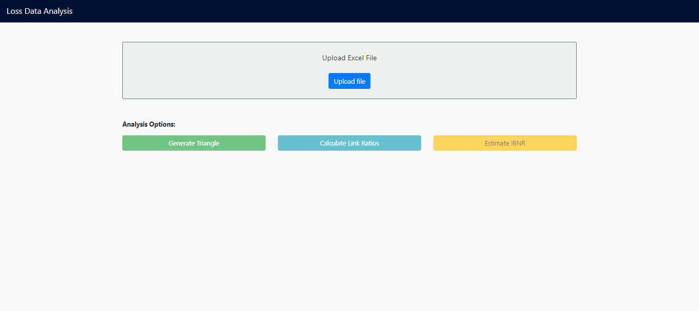
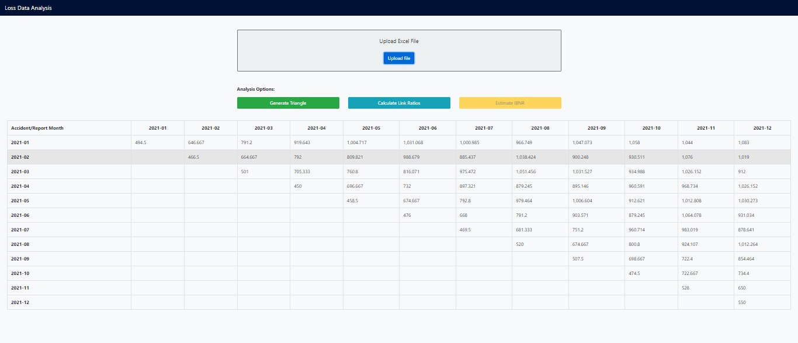
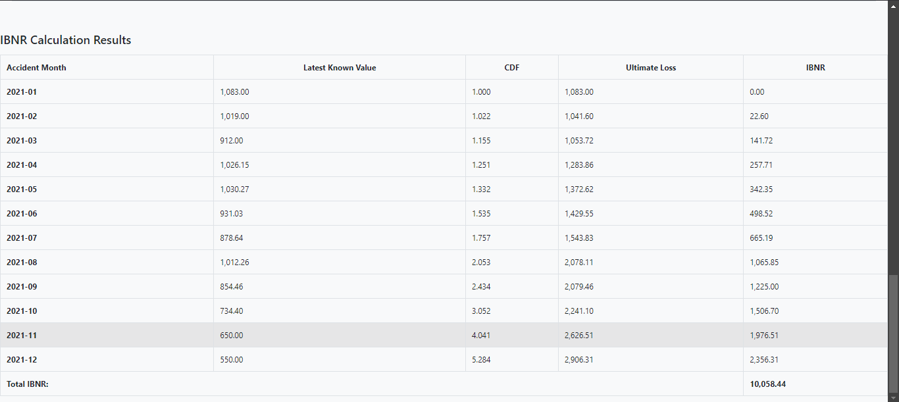

This document outlines the development process of the Loss Data Analysis application, built using Angular. The application allows users to upload Excel files containing loss data and performs various analyses, including generating a loss triangle, calculating link ratios, and calculating IBNR.

# Features
Excel File Upload: Users can upload .xlsx or .xls files.  

Data Processing: The application processes the uploaded data to generate loss triangles, calculate link ratios, and calculate IBNR.  

Dynamic Tables: Results are displayed in responsive tables.

# Project process
1. I started with checking the doc type to see what type of data we are working with.
2. learn what is loss triangle, link ratios, IBNR, chain ladder method.
3. start creating the interface.
4. create the generate loss triangle function.
5. create the link ratio functions.
6. create the IBNR function.

# Project structure
1. app.component.ts
The main TypeScript file contains the logic for file uploading, data processing, and displaying results.
2. app.component.html
Includes buttons for uploading files, displaying the results in tables.

Generate Loss Triangle

Calculate Link ratios

IBNR

